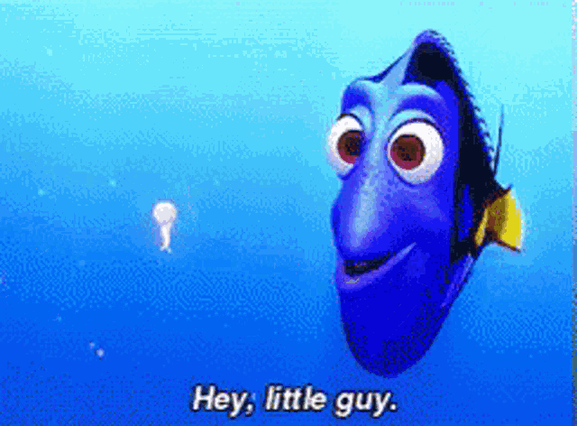

  

---

  

---

<h3 align="left">Skills</h3>

  
  
  
  
  
  
  
  
  
  
  
  
  
  

---

<h3 align="left">Socials</h3>

  <a href="https://www.github.com/Rafly1818" target="_blank" rel="noreferrer">
    <picture>
      <source media="(prefers-color-scheme: dark)" srcset="https://raw.githubusercontent.com/danielcranney/readme-generator/main/public/icons/socials/github-dark.svg" />
      <source media="(prefers-color-scheme: light)" srcset="https://raw.githubusercontent.com/danielcranney/readme-generator/main/public/icons/socials/github.svg" />
      
    </picture>
  </a>
  <a href="mailto:raflyravsanjani@gmail.com" target="_blank" rel="noreferrer" style="text-decoration: none; color: inherit; display: inline-block; text-align: center;">
    <picture>
      
    </picture>
  </a>
  <a href="http://www.instagram.com/flyyr_" target="_blank" rel="noreferrer">
    <picture>
      <source media="(prefers-color-scheme: dark)" srcset="https://raw.githubusercontent.com/danielcranney/readme-generator/main/public/icons/socials/instagram-dark.svg" />
      <source media="(prefers-color-scheme: light)" srcset="https://raw.githubusercontent.com/danielcranney/readme-generator/main/public/icons/socials/instagram.svg" />
      
    </picture>
  </a>

---

<h3 align="left">My GitHub Stats</h3>

  
  
  

---